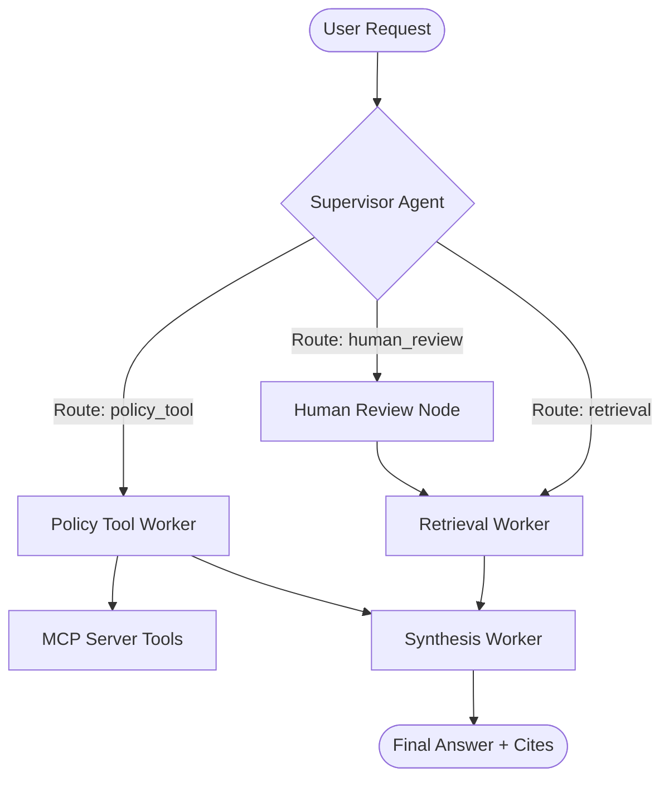

# System Architecture — Lab Day 09

**Nhóm:** ___________  
**Ngày:** ___________  
**Version:** 1.0

---

## 1. Tổng quan kiến trúc

> Mô tả ngắn hệ thống của nhóm: chọn pattern gì, gồm những thành phần nào.

**Pattern đã chọn:** Supervisor-Worker  
**Lý do chọn pattern này (thay vì single agent):**
Kiến trúc Supervisor-Worker cho phép phân rã một tác vụ phức tạp (vừa tìm thông tin, vừa kiểm tra chính sách, vừa gọi công cụ bên ngoài) thành các đơn vị xử lý độc lập. Điều này giúp nâng cao độ chính xác của từng worker và cung cấp khả năng quan sát (observability) tuyệt vời qua logic routing rõ ràng.

---

## 2. Sơ đồ Pipeline

> Vẽ sơ đồ pipeline dưới dạng text, Mermaid diagram, hoặc ASCII art.
> Yêu cầu tối thiểu: thể hiện rõ luồng từ input → supervisor → workers → output.

**Ví dụ (ASCII art):**
```
User Request
     │
     ▼
┌──────────────┐
│  Supervisor  │  ← route_reason, risk_high, needs_tool
└──────┬───────┘
       │
   [route_decision]
       │
  ┌────┴────────────────────┐
  │                         │
  ▼                         ▼
Retrieval Worker     Policy Tool Worker
  (evidence)           (policy check + MCP)
  │                         │
  └─────────┬───────────────┘
            │
            ▼
      Synthesis Worker
        (answer + cite)
            │
            ▼
         Output
```

**Sơ đồ thực tế của nhóm:**



---

## 3. Vai trò từng thành phần

### Supervisor (`graph.py`)

| Thuộc tính | Mô tả |
|-----------|-------|
| **Nhiệm vụ** | Phân tích ý định người dùng và điều hướng đến worker phù hợp. |
| **Input** | `task` (câu hỏi thô) |
| **Output** | supervisor_route, route_reason, risk_high, needs_tool |
| **Routing logic** | Keyword matching kết hợp kiểm tra rủi ro (risk matching). |
| **HITL condition** | Trigger khi phát hiện mã lỗi không xác định hoặc yêu cầu đặc biệt nhạy cảm. |

### Retrieval Worker (`workers/retrieval.py`)

| Thuộc tính | Mô tả |
|-----------|-------|
| **Nhiệm vụ** | Tìm kiếm và trích xuất các đoạn văn bản (chunks) liên quan từ vector DB. |
| **Embedding model** | OpenAI `text-embedding-3-small` |
| **Top-k** | Động (3 hoặc 4) dựa trên chỉ dẫn của Supervisor. |
| **Stateless?** | Yes |

### Policy Tool Worker (`workers/policy_tool.py`)

| Thuộc tính | Mô tả |
|-----------|-------|
| **Nhiệm vụ** | Kiểm tra các điều kiện chính sách và gọi tool bên ngoài để xác thực dữ liệu. |
| **MCP tools gọi** | `get_ticket_info`, `check_access_permission` |
| **Exception cases xử lý** | Các trường hợp ngoại lệ trong chính sách hoàn tiền/truy cập. |

### Synthesis Worker (`workers/synthesis.py`)

| Thuộc tính | Mô tả |
|-----------|-------|
| **LLM model** | OpenAI `gpt-4o` |
| **Temperature** | 0.0 (để đảm bảo tính ổn định và grounding) |
| **Grounding strategy** | Chỉ trả lời dựa trên `retrieved_chunks` và `policy_result`. |
| **Abstain condition** | Khi không có evidence hoặc confidence thấp hơn ngưỡng 0.4. |

### MCP Server (`mcp_server.py`)

| Tool | Input | Output |
|------|-------|--------|
| search_kb | query, top_k | chunks, sources |
| get_ticket_info | ticket_id | ticket details (P1 status, assignee, etc) |
| check_access_permission | access_level, requester_role | can_grant, approvers, emergency_override |

---

## 4. Shared State Schema

> Liệt kê các fields trong AgentState và ý nghĩa của từng field.

| Field | Type | Mô tả | Ai đọc/ghi |
|-------|------|-------|-----------|
| task | str | Câu hỏi đầu vào | supervisor đọc |
| supervisor_route | str | Worker được chọn | supervisor ghi |
| route_reason | str | Lý do route | supervisor ghi |
| retrieved_chunks | list | Evidence từ retrieval | retrieval ghi, synthesis đọc |
| policy_result | dict | Kết quả kiểm tra policy | policy_tool ghi, synthesis đọc |
| mcp_tools_used | list | Tool calls đã thực hiện | policy_tool ghi |
| final_answer | str | Câu trả lời cuối | synthesis ghi |
| confidence | float | Mức tin cậy (0-1) | synthesis ghi |
| history | list | Nhật ký các bước xử lý | Tất cả workers ghi |

---

## 5. Lý do chọn Supervisor-Worker so với Single Agent (Day 08)

| Tiêu chí | Single Agent (Day 08) | Supervisor-Worker (Day 09) |
|----------|----------------------|--------------------------|
| Debug khi sai | Khó — không rõ lỗi ở đâu | Dễ hơn — test từng worker độc lập |
| Thêm capability mới | Phải sửa toàn prompt | Thêm worker/MCP tool riêng |
| Routing visibility | Không có | Có route_reason trong trace |
| Khả năng mở rộng | Kém (phải sửa core prompt) | Tốt (chỉ cần thêm worker mới) |

**Nhóm điền thêm quan sát từ thực tế lab:**
Kiến trúc này giúp cô lập lỗi rất tốt. Khi synthesis trả lời sai, chúng ta có thể kiểm tra ngay xem do Retrieval lấy thiếu chunk hay do Policy phân tích logic sai.

---

## 6. Giới hạn và điểm cần cải tiến

> Nhóm mô tả những điểm hạn chế của kiến trúc hiện tại.

1. **Độ trễ (Latency)**: Việc chạy tuần tự qua nhiều agent làm tăng thời gian phản hồi.
2. **Chi phí (Cost)**: Mỗi câu hỏi tốn ít nhất 2-3 LLM calls thay vì 1.
3. **Sự phụ thuộc vào Keyword**: Router rule-based có thể thất bại với các câu hỏi có ngữ nghĩa phức tạp nhưng không chứa từ khóa định danh.
